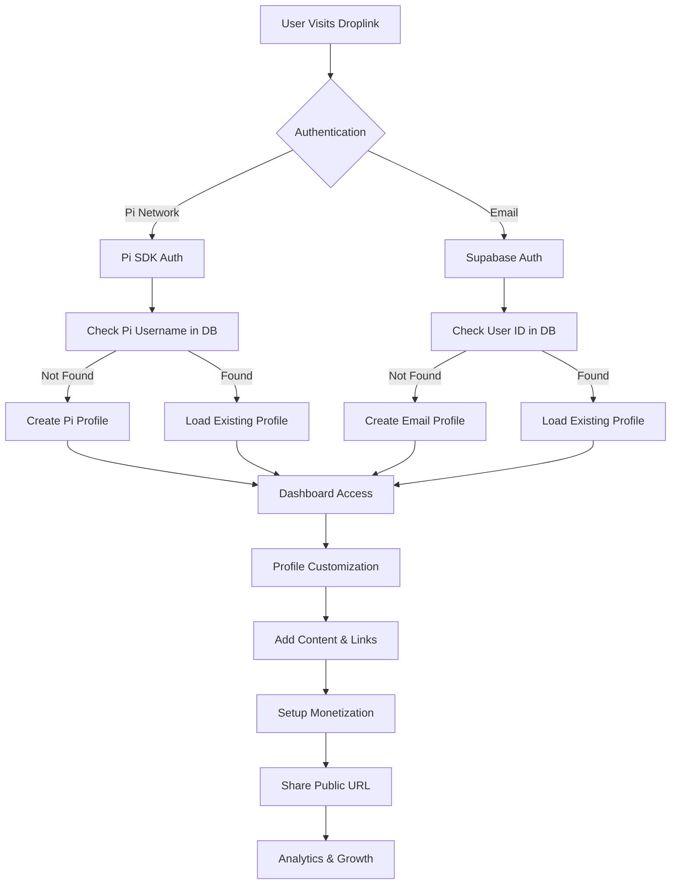
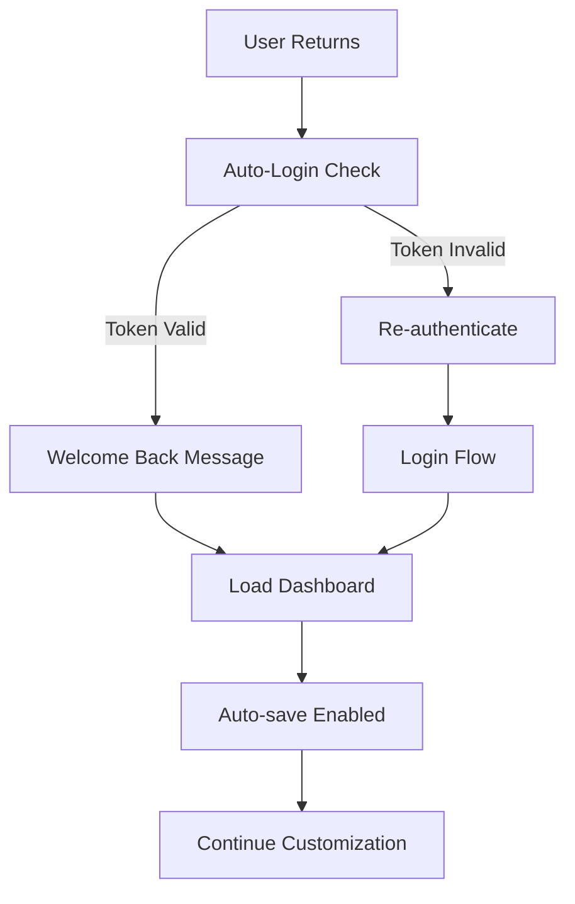

# 🚀 Droplink Complete Workflow Guide

## 🌟 **What is Droplink?**
Droplink is a **personal link-in-bio platform** where users create customizable profile pages to showcase their links, products, and social media - all shareable through one URL.

---

## 🎯 **User Journey: From Setup to Share**

### **1. 🔐 Authentication Options**
```
┌─────────────────┐    ┌─────────────────┐
│   Pi Network    │ OR │   Email/Gmail   │
│   Sign In       │    │   Sign Up       │
└─────────────────┘    └─────────────────┘
         │                       │
         └───────────┬───────────┘
                     │
              ┌─────────────┐
              │  Dashboard  │
              │   Access    │
              └─────────────┘
```

**Pi Network Users:**
- Authenticate with Pi Network (sandbox mode)
- Profile auto-created with Pi username
- Welcome message: "🎉 Welcome to Droplink, [username]!"

**Email Users:**
- Sign up with email/Gmail
- Profile created with email prefix as username
- Can later connect Pi Network for payments

---

### **2. 🎨 Profile Customization**

#### **Essential Setup:**
```
📝 Business Name    → Your display name
🖼️ Logo Upload     → Profile picture (optional)
📄 Description     → Bio/tagline
🎨 Theme Settings  → Colors, button styles, icons
```

#### **Content Addition:**
```
🔗 Social Links    → Instagram, Twitter, YouTube, etc.
🔗 Custom Links    → Any URL with custom titles & icons
🛍️ Digital Products → Files for sale with pricing
💰 Payment Options → Pi wallet, crypto, bank details
```

---

### **3. 💰 Monetization Flow**

#### **Pi Network Integration:**
```
1. User connects Pi wallet address
2. Sets donation message ("Send me a coffee ☕")
3. Visitors can send Pi payments directly
4. Ads shown to free users (Pi Ad Network)
```

#### **Product Sales:**
```
1. Upload digital products (PDFs, courses, etc.)
2. Set prices and descriptions
3. Visitors purchase through payment links
4. Automatic download delivery
```

---

### **4. 📱 Sharing & Analytics**

#### **Your Public URL:**
```
https://droplink.vercel.app/[your-username]
```

#### **Features Available:**
```
📊 Analytics        → Track views, clicks, engagement
👥 Followers        → Build audience with follow system
🎁 Gifts           → Receive Pi Network gifts
💬 AI Chat         → Visitors can chat with AI about you
📱 QR Codes        → Easy mobile sharing
```

---

## 🔄 **Complete Technical Workflow**

### **New User Flow:**


### **Returning User Flow:**


---

## 🎯 **Key Features & Benefits**

### **For Content Creators:**
- ✅ **One Link for Everything** - Replace multiple bio links
- ✅ **Monetization Ready** - Sell digital products, accept donations
- ✅ **Pi Network Integrated** - Earn cryptocurrency
- ✅ **Analytics Dashboard** - Track performance
- ✅ **Mobile Optimized** - Perfect on all devices

### **For Businesses:**
- ✅ **Professional Profiles** - Customizable branding
- ✅ **Lead Generation** - Capture visitor interest
- ✅ **Product Showcase** - Digital product sales
- ✅ **Social Integration** - Connect all platforms
- ✅ **Custom Domains** - Use your own URL

---

## 🛠️ **Technical Implementation**

### **Database Structure:**
```sql
profiles     → User profiles (username, business_name, theme, etc.)
products     → Digital products for sale
followers    → User follow relationships
analytics    → Page view and interaction tracking
financial    → Secure payment & wallet data
```

### **Authentication Flow:**
```typescript
// Pi Network users
username → profiles.username (unique)
pi_user_id → profiles.pi_user_id

// Email users  
user_id → profiles.user_id (Supabase UUID)
email → derived username
```

### **Auto-Save System:**
```typescript
// 3-second debounced saving
useAutoSave(profile, profileId, supabase)
- Monitors form changes
- Saves to database automatically
- Updates localStorage backup
```

---

## 🚀 **Success Metrics**

### **User Engagement:**
- Profile completion rate
- Link clicks and social follows
- Time spent on profile pages
- Repeat visitor percentage

### **Monetization:**
- Product sales conversion
- Pi payments received
- Ad revenue (Pi Network)
- Premium subscription upgrades

---

## 📋 **Current Status**

### ✅ **Working Features:**
- Pi Network authentication (sandbox)
- Profile creation and customization
- Auto-save functionality
- Public profile sharing
- Analytics tracking
- Product management
- Payment integration setup

### 🔧 **Development Mode:**
- All restrictions removed
- Full feature access
- Sandbox Pi Network
- Local development at `localhost:8082`

---

## 🎯 **User Value Proposition**

**"Create your personalized link-in-bio page, monetize your content with Pi Network, and grow your audience - all in one platform!"**

### **Simple Setup:**
1. Sign in with Pi Network or Email
2. Customize your profile in minutes  
3. Add your links and content
4. Share your unique URL
5. Start earning and growing!

**Your success is our success!** 🚀